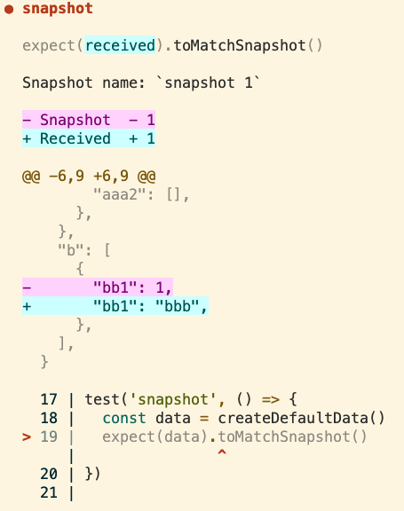
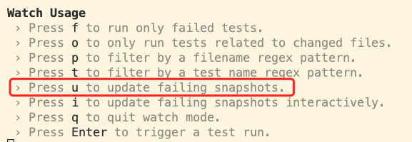

# 单测（Unit Test）技巧

## 前言
本文目的是提高编写单测的效率，适合于有一定单测编写经验，但被单测困扰的同学。  
*后文的示例都在 [unit-test-examples](https://github.com/hughfenghen/unit-test-examples) 仓库中。*  

## 单测的意义与价值
单测本质：将测试行为及结果固化下来，自动检查被测试代码的运行结果是否符合期望。  

- 单测是一种调试工具；在开发阶段验证代码是否符合期望，比浏览器中调试更有效率  
- 单测是一种项目文档；帮助了解SDK的API及如何使用  
- 单测能降低项目维护成本；拥有完整的单测用例后，单测执行结果会告诉你代码变更的影响范围  
- 单测能帮助你编写更加优秀的代码  

## 编码技巧

### 单测的边界
单元测试的目标是你写的代码，测试你写的代码符合期望（白盒测试），边界之外代码若有意外尽量 Mock。  
如何确定边界？  
1. 导入的第三方包  
2. 系统(Node.js, 浏览器)提供的部分 API，主要包括 fetch、document、fs

*使用Mock的方法技巧参考后文。*

### 编写易于测试的代码  
*优秀的代码有很多要素，优秀的代码肯定是易于测试的。*  

#### 隔离副作用代码
*函数副作用是指函数在正常工作任务之外对外部环境所施加的影响。*  

对JS来说，最常见的副作用是 网络请求、增删DOM节点、读写文件；  
副作用**不可避免**，但可以隔离后只测试相对比较纯的函数。  

<details>
<summary><span style="color: #1989fa; cursor: pointer;">展开查看示例代码</span>
</summary>

```js
// 错误示例
function createList(arr) {
  const ulEl = document.createElement('ul')
  arr.forEach((it) => {
    const li = document.createElement('li')
    li.textContent = it
    ulEl.appendChild(li)
  })
  // 其他逻辑。。。
  document.querySelector('container').appendChild(ulEl)
}

// 正确示例；检测返回值 比 mock document要简单得多
function createList(arr) {
  const ulEl = document.createElement('ul')
  arr.forEach((it) => {
    const li = document.createElement('li')
    li.textContent = it
    ulEl.appendChild(li)
  })
  // 其他逻辑。。。
  return ulEl
}

// 对于汇总了副作用的函数，可以使用 Mock 方法进行测试
// 也可以考虑略过，不编写测试代码，权衡成本即可
function insertList() {
  const arr = [1, 2]
  document.querySelector('container').appendChild(createList(arr))
}
```

</details>

#### 控制圈复杂度

[圈复杂度](https://baike.baidu.com/item/%E5%9C%88%E5%A4%8D%E6%9D%82%E5%BA%A6)简单来说就是逻辑分支越多，圈复杂度越高，单测用例覆盖代码越困难。  

圈复杂度跟业务复杂度相关，无法完全避免，但可通过编码技巧降低或拆分成多个函数，降低单测难度。  

<details>
<summary><span style="color: #1989fa; cursor: pointer;">展开查看示例代码</span>
</summary>


```js
// 错误示例
function envStr2Code(env) {
  if (env === 'dev') {
    return 1
  } else if (env === 'test') {
    return 2
  } else if (env === 'prod') {
    return 3
  } else {
    return -1
  }
}

// 如果要覆盖 所有语句
expect(envStr2Code('dev')).toBe(1)
expect(envStr2Code('test')).toBe(2)
expect(envStr2Code('prod')).toBe(3)
expect(envStr2Code('unknown')).toBe(-1)

// 正确示例
function envStr2Code(env) {
  return ({ dev: 1, test: 2, prod: 3 })[env] ?? -1
}
// 类似的还有
function envCode2Str(code) {
  return [null, 'dev', 'test', 'prod'][code] ?? 'unknown'
}
```

</details>

参考： [圈复杂度优化](https://cloud.tencent.com/developer/article/1806628)  
> 圈复杂度常用优化方法  
> 1. 算法优化  
> 1. 表达式逻辑优化  
> 1. 大函数拆小函数

## Jest 技巧
Jest是当前最流行的JS单测框架，下文介绍单测高频使用的技巧来提高编写单测代码的效率，未入门请阅读[官方文档](https://jestjs.io/zh-Hans/docs/getting-started)。  

### [Expect（断言）](https://jestjs.io/zh-Hans/docs/expect)
*基础的值判断 `.toBe`、`.toEqual` 等就不介绍了*  

- 当检测的数据只知道类型，但具体值是不确定的，就使用`expect.any(constructor)`  
- 当只需要检测数据的特征，如字符串的子串、数组的值、对象的key，使用`expect.stringContaining`、`expect.arrayContaining`、`expect.objectContaining`  
- `toHaveBeenCalled`用于判断Mock函数（通常是jest.fn）是否执行，还有多个以`toHaveBeenCalled`开头的函数用于判断执行Mock函数的参数、次数  

[expect 示例](https://github.com/hughfenghen/unit-test-examples/blob/main/src/expect/__tests__/expect.test.js)  

### Mock
- [fs](https://github.com/hughfenghen/unit-test-examples/blob/main/src/mock/__tests__/fs.test.js)；Mock 原生或第三方模块
- [Data.now](https://github.com/hughfenghen/unit-test-examples/blob/main/src/mock/__tests__/date-now.test.js)；拦截 now 返回特定的时间戳
- [fetch](https://github.com/hughfenghen/unit-test-examples/blob/main/src/mock/__tests__/fetch.test.js)；禁止单测发送 HTTP 请求，检测函数调用参数
- [location](https://github.com/hughfenghen/unit-test-examples/blob/main/src/mock/__tests__/location.test.js)；Mock 全局只读属性
- [dom](https://github.com/hughfenghen/unit-test-examples/blob/main/src/mock/__tests__/dom.test.js)  
  - Mock 所有 DOM 节点的方法 (HTMLElement.prototype.appendChild)  
  - Mock 只读属性 (MouseEvent.offsetX)
- [Mock ES6 Class](https://jestjs.io/zh-Hans/docs/es6-class-mocks#4-%E7%A7%8D%E6%96%B9%E5%BC%8F%E5%8E%BB%E6%A8%A1%E6%8B%9F-es6-%E7%B1%BB)  
  - 建议优先选择 [自动模拟](https://jestjs.io/zh-Hans/docs/es6-class-mocks#%E8%87%AA%E5%8A%A8%E6%A8%A1%E6%8B%9F)，使用 `ClassName.mock.instances` 获取源码深处创建的 class 实例
  - 如果场景简单，只需要 [mock 某个特定方法](https://jestjs.io/zh-Hans/docs/es6-class-mocks#mocking-a-specific-method-of-a-class)

### Timer
JS是单线程异步执行代码，所以需要API能精确控制定时器回调函数的执行时机，来完全掌控被测试代码的执行。  

- `jest.useFakeTimers()`所有[timer 定时器](https://jestjs.io/zh-Hans/docs/jest-object#%E5%81%87%E7%9A%84%E5%AE%9A%E6%97%B6%E5%99%A8)都会停止运行，需手动控制来执行定时器的回调函数  
  - `jest.advanceTimersByTime(msToRun)`相当于时间往前拨N毫秒，满足的条件的定时器回调函数将被执行
  - `jest.advanceTimersToNextTimer(steps)`相当于时间往前拨一定时间（不确定），恰好让第1..N个定时器回调被执行，是`jest.advanceTimersByTime`的快捷方式，控制次数而不是时间，[参考解释](https://stackoverflow.com/questions/71667406/explain-jest-advancetimerstonexttimer)  
- `jest.useRealTimers()`恢复真实定时器，`jest.useFakeTimers()`的反操作  
- `jest.runAllTicks()`执行所有微任务队列
- `jest.runAllTimers()`执行所有宏任务队列

[示例代码](https://github.com/hughfenghen/unit-test-examples/blob/main/src/timer/__tests__/jest-api.test.js)  

### [Snapshot 快照](https://jestjs.io/zh-Hans/docs/snapshot-testing)
快照经常用来检测 UI（DOM）结构是否符合期望，实际上只要检测的数据比较复杂（比如一个复杂JSON）就可使用快照来简化测试代码。  

快照是把上次检测的值序列化为字符串保存到本地文件中，后续检测如果不一致，单测用例就会报错。  
  
若结果**变化符合期望**，则需在交互界面按下【`u`】键去更新本地文件中的快照内容。  
  

如果快照中包含**随机数、时间戳、id**之类每次都会变化的值，默认情况每次执行结果都与上次有差异，导致用例失败，可参考[官方示例](https://jestjs.io/zh-Hans/docs/snapshot-testing#%E5%B1%9E%E6%80%A7%E5%8C%B9%E9%85%8D%E5%99%A8)  

[复杂数据快照示例](https://github.com/hughfenghen/unit-test-examples/blob/main/src/snapshot/__tests__/snapshot.test.js)  

### 配合 vscode
配合 vscode，在保存代码实时运行单测用例，反馈执行结果；且能在编辑器中随时断点 Debug。  
  
参考 vscode 配置：[.vscode/launch.json](https://github.com/hughfenghen/unit-test-examples/blob/main/.vscode/launch.json)

### Watch 模式
jest 启用 Watch 模式，会监听文件变化自动执行单测用例。  

[--watch](https://github.com/hughfenghen/unit-test-examples/blob/main/.vscode/launch.json#L17)表示vscode中运行单测时启用 Watch 模式。  

Debug 代码时，经常需要执行特定的用例，避免干扰。  
  
介绍几个Jest交互模式下高频使用的快捷键：  
- f: 仅运行失败的单测用例  
- p: 仅执行测试文件名匹配的单测用例  
- t: 仅执行测试用例名（test('用例名')）匹配的用例  
- u: 更新快照文件（前文介绍了）  
- q: 退出
