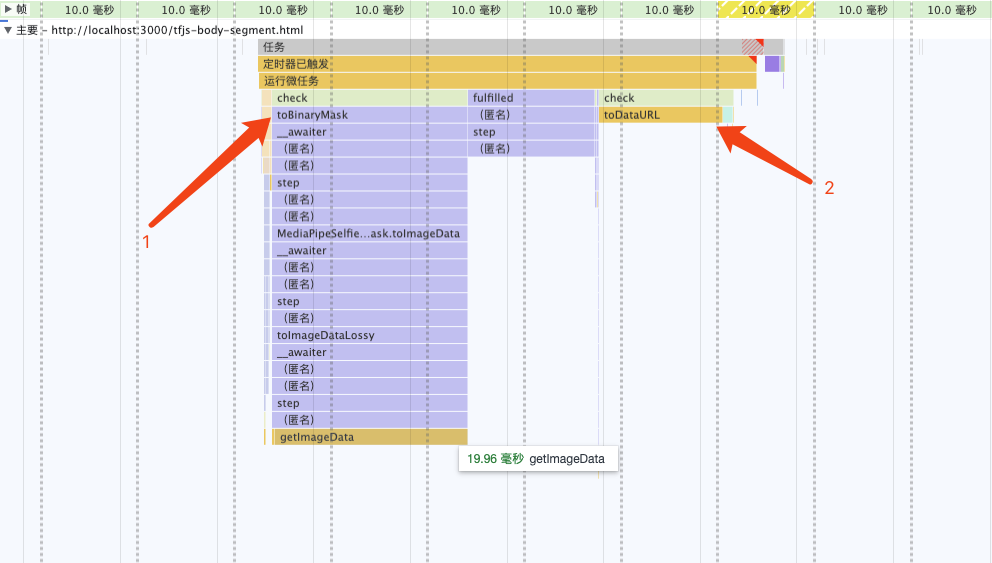
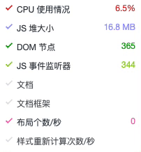

# Web 端实时防挡脸弹幕（基于机器学习）

**防档弹幕**，即大量弹幕飘过，但不会遮挡视频画面中的人物，看起来像是从人物背后飘过去的。  
  

## 前言
  
[mediapipe](https://google.github.io/mediapipe/)demo展示  

机器学习已经火了好几年了，但很多人的直觉仍然是前端实现不了这些能力，期望本文能打破一些“思维禁区”。

### 主流实现原理介绍
#### 点播
1. up 上传视频
2. 服务器后台计算提取视频画面中的人像区域，转换成 svg 存储  
3. 客户端播放视频的同时，从服务器下载 svg 与弹幕合成，人像区域不显示弹幕  

#### 直播
1. 主播推流时，实时（主播设备）从画面提取人像区域，转换成 svg  
2. 将 svg 数据合并到视频流中（SEI），推流至服务器  
3. 客户端播放视频同时，从视频流中（SEI）解析出 svg  
4. 将 svg 与弹幕合成，人像区域不显示弹幕  

### 本文实现方案
1. 客户端播放视频同时，实时从画面提取人像区域信息
2. 将人像区域信息导出成图片，与弹幕合成，人像区域不显示弹幕  

#### 实现原理
1. 采用机器学习开源库从视频画面实时提取人像轮廓，如[Body Segmentation](https://github.com/tensorflow/tfjs-models/blob/master/body-segmentation/README.md)  
2. 将人像轮廓转导出为图片，设置弹幕层的 [mask-image](https://developer.mozilla.org/zh-CN/docs/Web/CSS/mask-image)  

#### 面临的问题
众所周知“*JS 性能太辣鸡*”，不适合执行 CPU 密集型任务。  
由官方demo转换成工程实践，并非调一下API就行了，最大的挑战就是——**性能**。  

一开始我也不敢相信实时计算，能将 **CPU 占用优化到 <span style="color: red;">5%</span> 左右**（2020 M1 Macbook）  
甚至低于主流实现中，单在客户端上的性能损耗（解析 svg，与弹幕合成）  

---

------------------------------ 正片开始，以下是调优过程 ------------------------------  

---

## 选择机器学习模型
<details>
<summary><span style="color: #1989fa; cursor: pointer;">可展开</span>

[BodyPix](https://github.com/tensorflow/tfjs-models/blob/master/body-segmentation/src/body_pix/README.md) **X**  
精确度太差，有很明显的弹幕与面部重合现象  

</summary>

  

</details>


<details>
<summary><span style="color: #1989fa; cursor: pointer;">可展开</span>

[BlazePose](https://github.com/tensorflow/tfjs-models/blob/master/pose-detection/src/blazepose_mediapipe/README.md)**X**  
精确度跟后面的MediaPipe SelfieSegmentation差不多，因为提供了肢体点位信息，**CPU 占用相对高出 15% 左右**  

</summary>

  

```js
[
  {
    score: 0.8,
    keypoints: [
      {x: 230, y: 220, score: 0.9, score: 0.99, name: "nose"},
      {x: 212, y: 190, score: 0.8, score: 0.91, name: "left_eye"},
      ...
    ],
    keypoints3D: [
      {x: 0.65, y: 0.11, z: 0.05, score: 0.99, name: "nose"},
      ...
    ],
    segmentation: {
      maskValueToLabel: (maskValue: number) => { return 'person' },
      mask: {
        toCanvasImageSource(): ...
        toImageData(): ...
        toTensor(): ...
        getUnderlyingType(): ...
      }
    }
  }
]
```
</details>

<details>
<summary><span style="color: #1989fa; cursor: pointer;">可展开</span>  

[MediaPipe SelfieSegmentation](https://github.com/tensorflow/tfjs-models/blob/master/body-segmentation/src/selfie_segmentation_mediapipe/README.md) **√**  
精确度优秀，只提供了人像区域信息，性能取胜  

</summary>

  

```js
{
  maskValueToLabel: (maskValue: number) => { return 'person' },
  mask: {
    toCanvasImageSource(): ...
    toImageData(): ...
    toTensor(): ...
    getUnderlyingType(): ...
  }
}
``` 
</details>

---

参考[官方实现](https://github.com/tensorflow/tfjs-models/blob/master/body-segmentation/README.md#bodysegmentationdrawmask)，未做优化的情况下
**<span style="color: red;">CPU 占用 70% 左右</span>**  
```ts
const canvas = document.createElement('canvas')
canvas.width = videoEl.videoWidth
canvas.height = videoEl.videoHeight
async function detect (): Promise<void> {
  const segmentation = await segmenter.segmentPeople(videoEl)
  const foregroundColor = { r: 0, g: 0, b: 0, a: 0 }
  const backgroundColor = { r: 0, g: 0, b: 0, a: 255 }

  const mask = await toBinaryMask(segmentation, foregroundColor, backgroundColor)

  await drawMask(canvas, canvas, mask, 1, 9)
  // 导出Mask图片，需要的是轮廓，图片质量设为最低
  handler(canvas.toDataURL('image/png', 0))

  window.setTimeout(detect, 33)
}

detect().catch(console.error)
```

## 降低提取频率，平衡 性能-体验
一般视频 30FPS，尝试弹幕遮罩（后称 Mask）刷新频率降为 15FPS，体验上还能接受  
*（再低就影响体验了）*  
```ts
window.setTimeout(detect, 66) // 33 => 66
```
此时，**<span style="color: red;">CPU 占用 50% 左右</span>**  

## 解决性能瓶颈代码
  

分析火焰图可发现，性能瓶颈在 `toBinaryMask` 和 `toDataURL`

### 重写toBinaryMask
分析源码，结合打印`segmentation`的信息，发现`segmentation.mask.toCanvasImageSource`可获取原始`ImageBitmap`对象，即是模型提取出来的信息。  
尝试自行实现将`ImageBitmap`转换成 Mask 的能力，替换开源库提供的默认实现。  

**实现原理**  
```ts
async function detect (): Promise<void> {
  const segmentation = await segmenter.segmentPeople(videoEl)

  context.clearRect(0, 0, canvas.width, canvas.height)
  // 1. 将`ImageBitmap`绘制到 Canvas 上
  context.drawImage(
    // 经验证 即使出现多人，也只有一个 segmentation
    await segmentation[0].mask.toCanvasImageSource(),
    0, 0,
    canvas.width, canvas.height
  )
  // 2. 设置混合模式
  context.globalCompositeOperation = 'source-out'
  // 3. 反向填充黑色
  context.fillRect(0, 0, canvas.width, canvas.height)
  // 导出Mask图片，需要的是轮廓，图片质量设为最低
  handler(canvas.toDataURL('image/png', 0)) 

  window.setTimeout(detect, 66)
}
```
第 2、3 步相当于给人像区域外的内容填充黑色（反向填充`ImageBitmap`），是为了配合css（mask-image），
不然只有当弹幕飘到人像区域才可见（与目标效果正好相反）。  
[globalCompositeOperation MDN](https://developer.mozilla.org/zh-CN/docs/Web/API/CanvasRenderingContext2D/globalCompositeOperation)  

此时，**<span style="color: red;">CPU 占用 33% 左右</span>**  

### 多线程优化
只剩下`toDataURL`这个耗时操作了，本以为`toDataURL`是浏览器内部实现，无法再进行优化了。  
虽没有替换实现，但可使用 [OffscreenCanvas](https://developer.mozilla.org/zh-CN/docs/Web/API/OffscreenCanvas) + Worker，将耗时任务转移到 Worker 中去，
避免占用主线程，就不会影响用户体验了。  
并且`ImageBitmap`实现了`Transferable`接口，可被转移所有权，[跨 Worker 传递也没有性能损耗](../../fe-basic-course/js-concurrent.md#两个方法对比)。  

```ts
// 前文 detect 的反向填充 ImageBitmap 也可以转移到 Worker 中
// 用 OffscreenCanvas 实现， 此处略过

const reader = new FileReaderSync()
// OffscreenCanvas 不支持 toDataURL，使用 convertToBlob 代替
offsecreenCvsEl.convertToBlob({
  type: 'image/png',
  quality: 0
}).then((blob) => {
  const dataURL = reader.readAsDataURL(blob)
  self.postMessage({
    msgType: 'mask',
    val: dataURL
  })
}).catch(console.error)
```

  

可以看到两个耗时的操作消失了  
此时，**<span style="color: red;">CPU 占用 15% 左右</span>**  

## 降低分辨率
继续分析，上图重新计算样式（紫色部分）耗时约 3ms  
Demo 足够简单很容易推测到是这行代码导致的，发现 `imgStr` 大概 100kb 左右（视频分辨率 1280x720）。  
```ts
danmakuContainer.style.webkitMaskImage = `url(${imgStr})`
```

**优化实现**
```ts
// 拉伸 mask-image
danmakuContainer.style.webkitMaskSize = '100%, 100%' 

const cvsEl = document.createElement('canvas')
// 将宽度缩小至 300 像素 
const approWidth = 300
if (videoEl.videoWidth > approWidth) {
  cvsEl.width = approWidth
  // 保持比例
  cvsEl.height = videoEl.videoHeight * approWidth / videoEl.videoWidth
}
const ctx = cvsEl.getContext('2d')

async function detect (): Promise<void> {
  // 缩小视频
  ctx.drawImage(videoEl, 0, 0, cvsEl.width, cvsEl.height)
  // 提取 Mask，使用缩小的 cvsEl 代替 videoEl
  const segmention = await segmenter.segmentPeople(cvsEl)
  // ...
}
```
优化后，导出的 `imgStr` 大概 12kb，重新计算样式耗时约 0.5ms。  
此时，**<span style="color: red;">CPU 占用 5% 左右</span>**  

  

## 启动条件优化
虽然提取 Mask 整个过程的 CPU 占用已优化到可喜程度。  
当在画面没人的时候，或没有弹幕时候，可以停止计算，实现 0 CPU 占用。  

*无弹幕判断比较简单（比如 10s 内收超过两条弹幕则启动计算），也不在该 SDK 实现范围，略过*  

**判定画面是否有人**  
第一步中为了高性能，选择的模型只有`ImageBitmap`，并没有提供肢体点位信息。  
所以只能使用`ImageBitmap`来判断是否有人。  
```ts
// ...
const dataURL = reader.readAsDataURL(blob)
// postMessage...

const hasBody = checkHasBody(ctx)
// undfined 表示本次被节流，未进行检测
if (!hasBody) {
  // postMessage 告诉主线程 逐渐降低检测频率，[1, 3, 5]秒 检测一次
}

function checkHasBody (ctx): boolean {
  const imgData = ctx.getImageData(0, 0, imgW, imgH)
  // imgData 是 Uint8ArrayBuffer, 每个像素 4 字节 [r, g, b, a]
  // 转成 Uint32Array 相当于一个像素点对应一个比较大的整数
  const img = new Uint32Array(imgData.data.buffer)
  const len = img.length
  // 从中间开始检测，人像在中间的几率更高
  const p = Math.floor(len / 2)
  const maxDistance = Math.floor(len / 2)
  let distance = 0
  while (true) {
    if (distance > maxDistance) return false
    // 某个像素值为 0 表示该像素点透明 { r:0, g:0, b:0, a:0 }
    // 说明该点是人像区域内的一个点
    if (img[p + distance] === 0) return true
    if (img[p - distance] === 0) return true

    // 从中间开始分别向左右跳跃检测
    // 人像区域是连续的，每次跳 10 像素，提升性能也不会误判
    distance += 10
  }
}
```
画面无人时，**<span style="color: red;">CPU 占用接近 0%</span>**  

## 发布构建优化
虽然优化耗时较长，完整的代码差不多 200 行，核心代码都贴出来了。  
但依赖包的提交较大，构建出的 bundle 体积：`684.75 KiB / gzip: 125.83 KiB`  

所以，可以进行异步加载SDK，提升页面加载性能。  
1. 分别打包一个 loader，一个主体
2. 由业务方 import loader，首次启用时异步加载主体

这个两步前端工程已经非常成熟了，略过细节。  

## 总结
### 过程
- 选择高性能模型后，初始状态 CPU 70%
- 降低 Mask 刷新频率（15FPS），CPU 50%
- 重写开源库实现（toBinaryMask），CPU 33%
- 多线程优化，CPU 15%
- 降低分辨率，CPU 5%
- 判断画面是否有人，无人时 CPU 接近 0%

*CPU 数值指主线程占用*  

### 注意事项
- **兼容性**：Chrome 79及以上，不支持 Firefox、Safari。因为使用了`OffsccenCanvas`  
- 不应创建多个或多次创建`segmenter`实例（bodySegmentation.createSegmenter），如需复用请保存实例引用，因为：  
  - 创建实例时低性能设备会有明显的卡顿现象  
  - 会内存泄露；如果无可避免，这是[mediapipe 内存泄露 解决方法](https://github.com/google/mediapipe/issues/2819#issuecomment-1160335349)  

### 经验
- 优化完成之后，提取并应用 Mask 关键计算量在 GPU (30%左右)，而不是 CPU  
- 性能优化需要业务场景分析，防档弹幕场景可以使用低分辨率、低刷新率的 mask-image，能大幅减少计算量  
- 该方案其他应用场景：
  - 替换/模糊人物背景
  - 人像马赛克
  - 人像抠图
  - 卡通头套，虚拟饰品，如猫耳朵、兔耳朵、带花、戴眼镜什么的（换一个模型，略改）  
