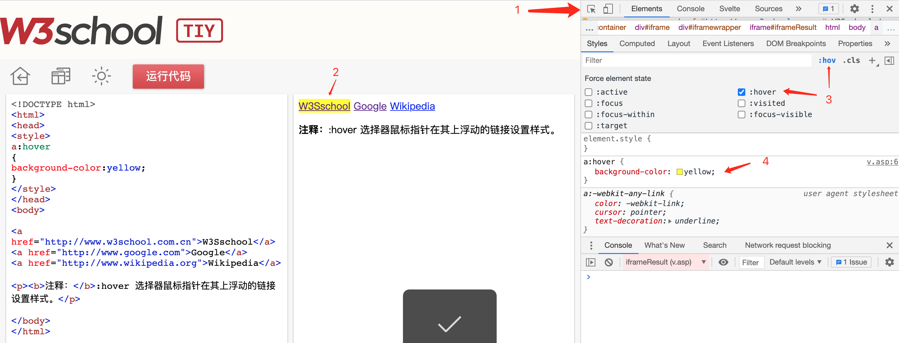
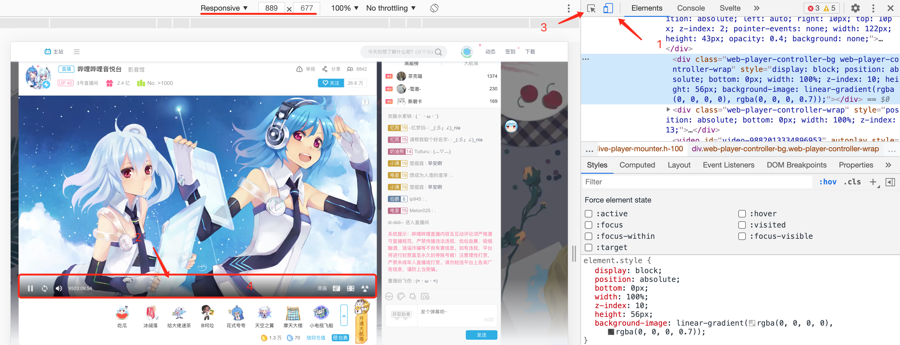

# 调试鼠标悬浮（hover）元素的css技巧

有两种方式实现元素的鼠标悬浮交互：  
1. css；使用伪类`.foo:hover{ /* 悬浮时样式 */ }`  
2. js；通过监听元素的`mouseenter`、`mouseleave`事件，控制元素的样式  

## 方法一
使用 chrome devtools 提供的样式调试工具  

比如修改悬浮时文字的背景色， [Demo](https://www.w3school.com.cn/tiy/t.asp?f=eg_css_sel_hover)    
  

:::tip
某些元素hover伪类css写在父元素上，此时需要选中父元素，勾选`:hover`，再选中节点，才能 css 面板中看到样式  
:::

***某些场景，元素只有在鼠标悬浮时（通过 js 事件控制）才会出现，导致 devtools 无法定位到元素，方法一也无法用了。***  

## 方法二
利用浏览器模拟移动端时，有 touch 事件，但不触发鼠标移动相关事件。  

以修改播放器的视频控制栏背景色为例： [https://live.bilibili.com/3](https://live.bilibili.com/3)  

1. 打开 devtools ，将页面设置为手机模式（如果画面显示区域太小，在正上方选择Responsive，自定义分辨率）    
2. 在播放器控制栏位置的空白区域（此时控制栏应不显示）点击一下  
3. 控制栏即会显示，且鼠标移开不会消失  
4. 使用 devtools 选择工具选中节点，即可编辑样式  

  