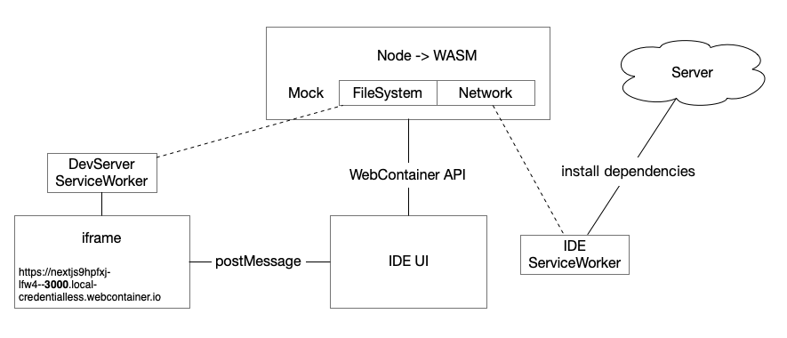

# WebContainer 原理分析

[WebContainer](https://webcontainers.io/)惊艳的地方有两点
1. 能在浏览器中运行Node服务，居然还能启动 DevServer “监听端口”
2. 离线后 IDE 开发中的页面也能正常开发

## 大致原理

以 <https://stackblitz.com/edit/nextjs-9hpfxj?file=package.json> 为例  

_略过了一些数据转发环节_

核心部分是将 Node 编译成 WASM，然后 Mock 文件系统、底层网络模块 使其能在浏览器中运行。  

比如安装依赖 react-dom 对应的网络请求是：  
<https://t.staticblitz.com/w/v13/h/e/react-dom@18.2.0?o=https://stackblitz.com>  

在浏览器中运行 DevServer 时，当然无法监听 TCP 端口。  
巧妙的地方是将端口映射成唯一的域名，通过 ServiceWorker 拦截域名下的所有请求，关联到 Mock的文件系统。  

## 启动过程
_下面的URL是动态生成，内容在本地的ServiceWorker中，不可访问，仅作为理解结构的示例_

1. 浏览器加载 IDE 页面，注册 IDE ServiceWorker
2. 初始化 WebContainer，IDE 与 WebContainer 通过 API 通信，IDE 将代码传入容器（挂载）
3. WebContainer 的网络模块被 Mock，网络请求（install dependencies）通过 IDE ServiceWorker 发出去并缓存
4. Node（WASM）运行代码，将端口映射成唯一URL
    - 例： https://nextjs9hpfxj-lfw4--3000.local-credentialless.webcontainer.io 
5. iframe 发一起 relay html 请求，并在请求中注册 DevServer ServiceWorker （**这步需要访问互联网**）
    - html： https://nextjs9hpfxj-lfw4--3000.local-credentialless.webcontainer.io/.localservice@relay.88d3a49b591611919d7d64c44b90ff5f8e939906.html
    - DevServer ServiceWorker ： https://nextjs9hpfxj-lfw4--3000.local-credentialless.webcontainer.io/.localservice@service.88d3a49b591611919d7d64c44b90ff5f8e939906.worker.js
6. iframe 加载主 HTML，该请求被 DevServer ServiceWorker 拦截，转发到 IDE ServiceWorker，使用文件系统（Mock）中资源作为response
    - 主HTML是 步骤4 生成的URL
7. 主HTML引入的 js、css 也会被 DevServer ServiceWorker 拦截并转发，所以离线也能正常访问

*实际情况肯定非常复杂， Service Worker 玩得太6了。*  