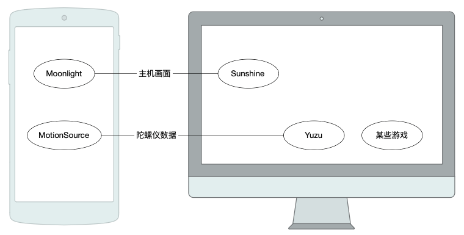
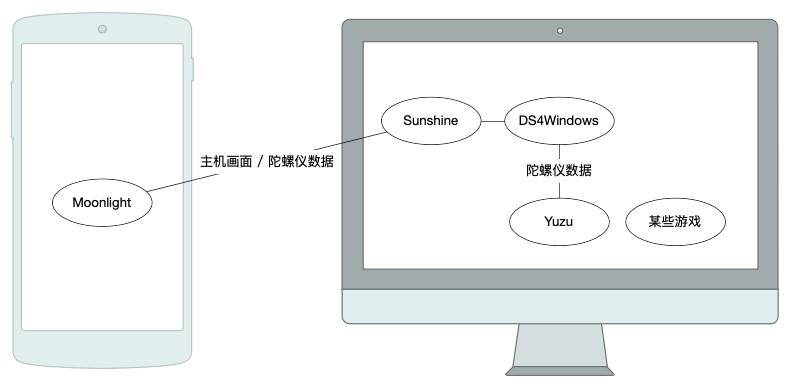
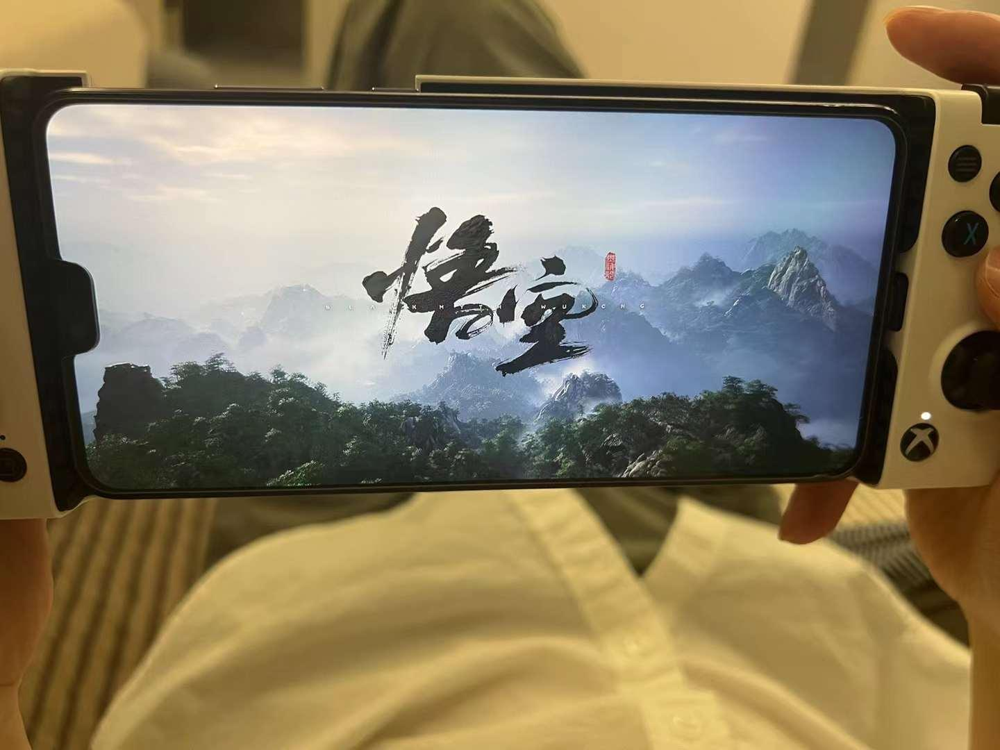
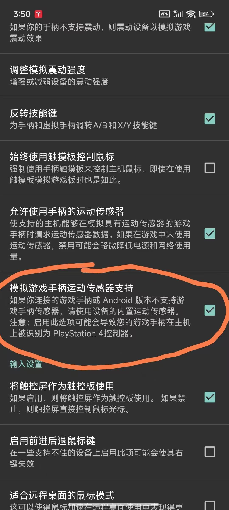
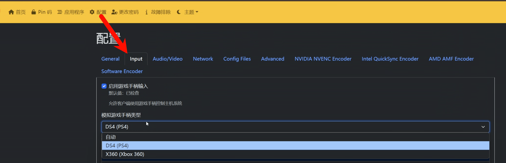
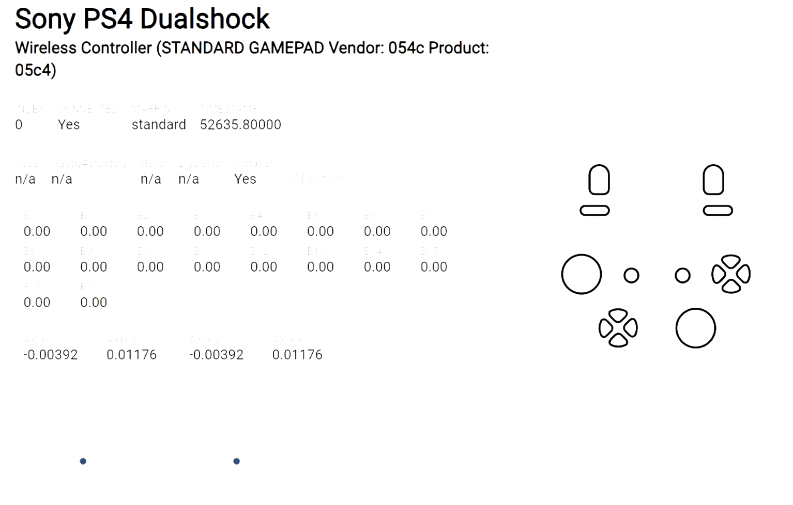
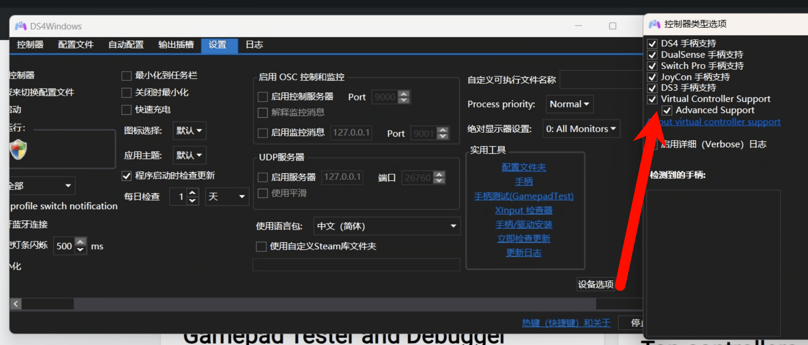

---
tags:
  - 游戏
date: 2025-04-18
---

艹，sunshine + moonlight 强制 DS4 之后，yuzu 支持识别 DS4 手柄，白写教程了

# 2025 最新手机串流玩体感游戏方案

## 个人介绍

我是刚从 B 站离职的 Web 自由开发者，有兴趣的同学可以关注我的博客或公众号。

【_视频教程连接，稍晚更新_】

本次内容属于个人兴趣，跟我的专业无关。

## 背景

[23 年 DIY 游戏掌机（串流）文章](https://fenghen.me/posts/2023/06/21/diy-handheld-game/)  
[模拟器玩体感游戏视频教程](https://www.bilibili.com/video/BV1cs4y167iB/)

缺点：

- parsec 登录很麻烦，适合远程办公，我一般都是在局域网串流玩游戏
- MotionSource 版本太老，无人维护且费电，还需额外配置允许后台运行
- 手机每次连接需要运行 moonlight + MotionSource 两个程序

## 新方案

优点：

- moonlight 连接更简单，操作更舒服
- moonlight 原生支持采集手机陀螺仪数据（体感）、手机震动反馈

moonlight 设计更偏向于游戏场景。  
极限接近掌机体验，且还有屏幕、续航方面的优势。

### 软硬件

- Android 手机 + 手柄  
  
- 串流：[Sunshine](https://github.com/LizardByte/Sunshine) + [Moonlight](https://moonlight-stream.org/)
- [DS4Windows](https://github.com/schmaldeo/DS4Windows/releases)，**注意是 schmaldeo 维护的版本**
- [手柄测试程序](https://hardwaretester.com/gamepad)

### 步骤

1. 下载、安装、连接（略过）
2. 手机 moonlight 勾选【模拟运动传感器支持】选项  
   

3. 检查 Sunshine 配置 -> input -> 手柄类型，选择**自动/DS4**  
   

4. 检测手柄类型是否为 DS4  
   

5. DS4Windows 配置
   1. 语言包设置为中文、开机自启动
   2. 点击**设备选项**，勾选所有类型  
      
