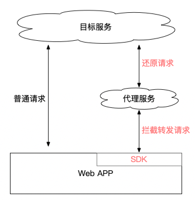
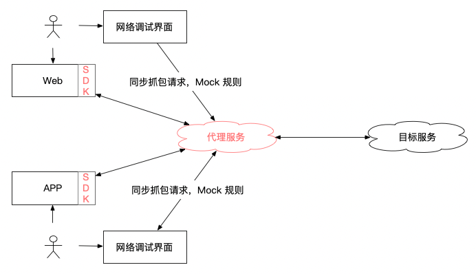

# Web 自集成式 HTTP 代理方案

大部分程序员，想必都有一个常用的抓包代理工具；  
但在座的各位，可曾见过这样一款**集成在 Web 应用中**的代理工具？

《视频》

它是明显区别于传统（通用）代理工具的，有一下特性：

- 零安装，零配置，Web 点击即用、APP 扫码即用；_（不是开盖即食，而是直接喂到嘴里_
- 分享 URL 链接，即可远程抓包 Mock，协助他人或远程调试移动设备
- 远程共享代理或 Mock 规则

以一个场景举例

1. 你是一个前端开发，当后端接口还没准备好（或有 Bug 时），产品或设计师想体验效果
2. 传统办法，你配好接口 Mock，让产品使用你的设备体验
3. 当前方案，你配好接口 Mock，发一个 URL 链接给产品即可远程体验

它的原理是将代理服务与应用（Web 网页或 APP）集成，从而大幅降低用户（研测产运）的使用成本。
  
_应用集成代理服务对应的 SDK，自动转发请求到代理服务_

传统代理工具的主要成本：

- 下载安装代理程序，甚至收费
- 配置系统代理（移动端更烦）、https 证书
- 同事之间共享代理规则（手动导入导出文件）

这些成本直接将非技术岗位拒之门外，也给开发带来各种烦恼。  
_中午去吃饭的时候，手机突然断网；艹，原来是刚刚网络调试，配置了系统代理！_

该方案无意替代通用代理工具（Charles、Fiddler 等），它是为了优化研发测试**对公司的 Web 应用、APP** 进行网络调试的效率；  
该方案是一个增强型功能，与通用代理工具没有任何冲突，不会影响习惯使用通用代理工具的同学。

笔者尝试过多款代理工具，始终有不满意的地方，多年前在自己的开源项目 [Erra][1] 中探索新的代理方案，仍然不满意，遂放弃。

后来将 Erra 的代理服务与工作中的应用集成，借鉴 [whistle][2] 的规则，再重新实现 UI 交互（就是当前方案），终觉尚可。  
该方案从根本上改变了抓包、Mock、调试网络请求的交互方式。

接下来介绍该方案的技术实现思路。

## 方案原理概览

总结分为以下四个部分

1. 与应用集成，将请求转发到代理服务，由代理服务转发请求到目标服务
2. 代理服务提供 UI 界面，允许用户查看网络请求、配置 Mock 规则
3. 代理服务记录请求，并同步到 UI 界面
4. 代理服务在转发请求前、收到响应后，按 Mock 规则篡改请求内容

## 应用集成

与应用集成是当前方案区别与代理工具的根本所在，也是能实现零安装、零配置便捷性的原因。

集成即是将代理服务对应的 SDK 注入到业务系统（网页或 APP）中，SDK 会拦截并转发请求到代理服务

- 注册 DNS、或项目手动注入拦截代码
- 拦截请求，按协议转发
- 页面跳转保持 参数

## 代理协议

- URL 启动参数
  - proxyid、header
- 请求转发 header
- 代理服务 解析 header，还原转发请求，并记录

注

- 移动端扫码、WebView 注入

## 代理服务与交互

- 抓包
- 远程调试
- Mock
- 规则设计、解析、分享

## 相对传统方案的缺点

## 附录

- [Erra][1]: Node.js 实现的代理工具，已废弃
- [whistle][2]: 基于 Node 实现的跨平台抓包调试工具

[1]: https://github.com/hughfenghen/erra
[2]: https://github.com/avwo/whistle
