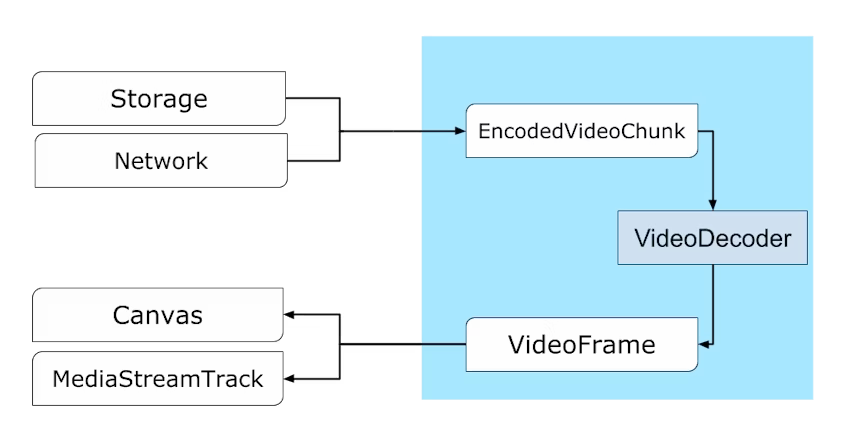

# Webcodecs 开启 Web 音视频新篇章 

## Webcodecs 是什么

- WebCodecs 是一个 Web 规范，21 年 9 月份在 Chrome 94 中实现
- WebCodecs 提供访问音视频帧的底层接口，可精细控制音视频数据

### 解决什么问题
音视频技术在 Web 平台上的应用非常广泛，已有许多 Web API 调用编解码器来实现特定功能  
- 视频播放：MSE、HTMLMediaElement
- 音频解码：WebAudio
- 录制视频：MediaRecorder
- 实时流媒体：WebRTC
  
但没有方法可以灵活配置或直接访问编解码器，所以许多应用使用 JS 或 WASM （比如 ffmpeg.js）来实现编解码功能，尽管存在诸多缺陷或限制  
- 降低了性能（Webcodecs 编码速度可达到 ffmpeg.js 的 20 倍）
- 增加功耗
- 额外网络开销下载已内置的编解码器

这么做的原因是 Web API 在特定场景都存在难以克服的障碍  
- WebAudio 只能解码完整的音频文件，但不支持数据流、不提供解码进度信息、更不支持编码
- MediaRecorder 只能录制特定格式（WebM、MP4）的视频，无法控制编码速度、输出缓冲区等
- WebRTC 与 MediaStream API 高度耦合，且不透明，仅能用于实时音视频通信
- Video 标签、MSE 最常用于视频播放，但无法控制解码速率、缓冲区长度，且支持播放部分视频容器格式

**总结**：在特定场景做到简单、够用，但无法实现高效且精细地控制  

### 设计目标

- **流式传输**：对远程、磁盘资源进行流式输入输出
- **效率**：充分利用设备硬件，在 Worker 中运行
- **组合性**：与其他 Web API(如 Streams、WebTransport 和 WebAssembly)配合良好
- **可恢复性**：在出现问题时能够恢复的能力(网络不足、资源缺乏导致的帧下降等)
- **灵活性**：能适应各种场景(硬实时、软实时、非实时)，能在此之上实现类似 MSE 或 WebRTC 的功能
- **对称性**：编码和解码具有相似的模式

### 非目标
- 视频容器 封装/解封装 相关 API
- 在 JS 或 WASM 中实现编解码器

以上总结于[译 WebCodecs 说明][1]，让大家快速了解 WebCodecs API 的设计目的

<!-- PPT 配图 -->
<!-- 二维码：WebCodecs 提案 说明， 原文、译文 -->

## Webcodecs 能做什么

### Webcodecs API 介绍

先了解 Webcodecs API 在视频生产消费链路所处的位置  

由图可知 Webcodecs API  
**提供的能力**  
- 控制编解码过程
- 访问编解码前后的底层数据

- `VideoFrame、EncodedVideoChunk` 对应编码前的源图像和编码后的压缩数据，两者均提供获取底层二进制数据的接口；  
- `VideoEncoder、VideoDecoder` 用于 `VideoFrame、EncodedVideoChunk` 两者的类型转换
- 这里可以看到编码、解码过程在 API 设计上的对称性
- 图像编解码习得的知识，可以对称迁移到音频编解码

  
音频数据转换可 Web Audio 配合，涉及的 API 比图像数据更多一些  

以上就是 WebCodecs 提供的核心 API，新增 API 的数量非常少；  
不过，设计的音视频背景知识、与之相互配合的 Web API 需要一定时间学习  

音视频生产消费链路中，WebCodecs **不涉及部分**由其他 Web API 提供  
- 音视频数据的采集与渲染
  - 源：navigator.mediaDevices、Canvas、Web Audio ...
  - 输出：Canvas、Web Audio、HTMLMediaElement ...
- 封装/解封装
  - 第三方库提供，可由 JS/WASM 实现
- 传输、存储
  - fetch、WebTransport、OPFS ...

基于 Web 平台已有的能力，加上 WebCodecs 提供的编解码能力，能帮助开发者实现那些功能呢？  

### 视频生产，从零到一
填补空白

**视频合成**
片段合成，配音、配字幕

**视频录制**
能制作酷炫的动效、交互，却无法保存下来

### 视频消费，精细控制
超低延迟播放

### 算力转移，实时交互
<!-- 大势所趋 -->
转码、降低画质、变速、生成预览图
众多小工具能在用户设备完成，且实时预览进度

### DEMO 演示
解码、合成

## 如何实现
怎么做
API介绍、
WebAV 项目介绍、示例
Bloom Shadow介绍、远程协同示例

<!-- 二维码：WebAV、系列文章 -->

## WebCodecs 会带来什么改变
WebCodecs 的应用场景、案例

大局方向  多元丰富、可能性
圈：WebGPU、OPFS、WebTransport、WebRTC、WASM

预测 困难；并非资深音视频专家

### 关键用例

### 举例 富文本
、figma、web ps

### 基础能力

## WebCodecs 的优势与挑战

### 优
基于 Web 平台
跨平台、开发效率

### 挑战
兼容性
生态不成熟
受限于平台提供的编解码器

[1]: /posts/2023/10/02/webcodecs-explainer/